# 1. This deep learning project made using Convolutional-ltsm and dense layers 
from tensor-flow keras to predict one half of an images pixels, given the first half either 
splitting the image horizontally or vertically. the network was trained using 70,000 images 
of faces from [Flickr-Faces-HQ Dataset (FFHQ)](https://drive.google.com/file/d/1Wrr6qZA1Tr6r9edNL2nSxnwopMW1n6pR/view?usp=sharing)

## Examples:
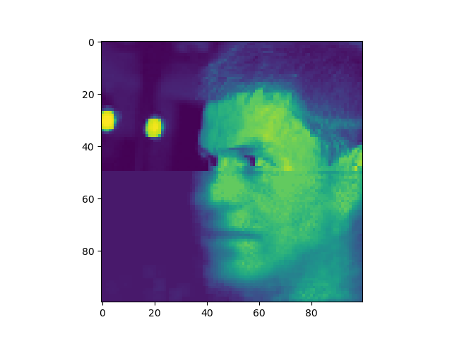

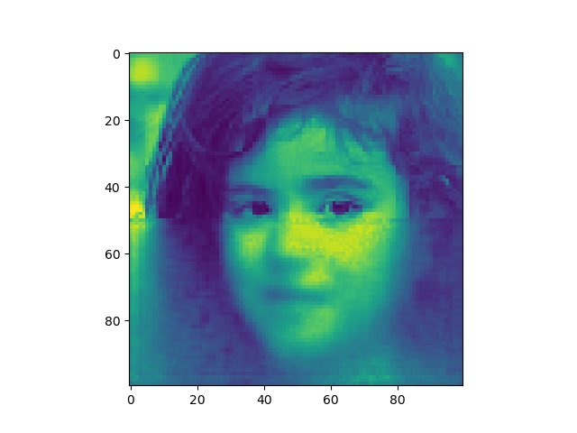

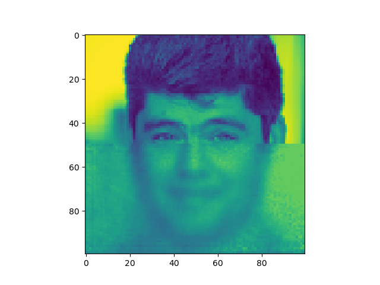

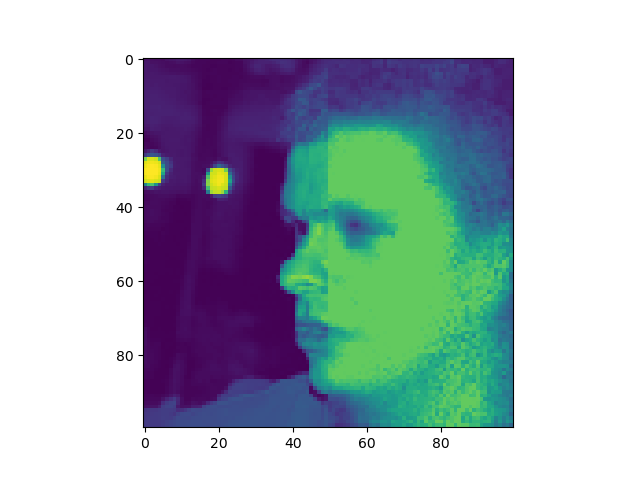

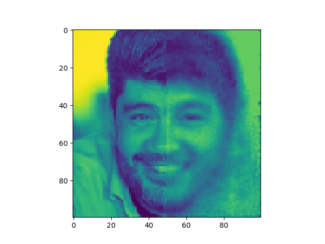

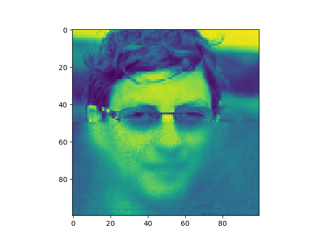

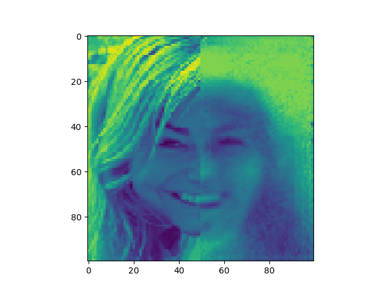

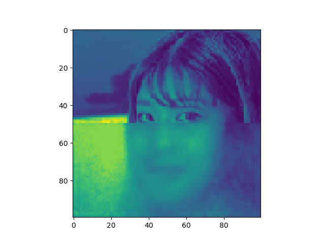

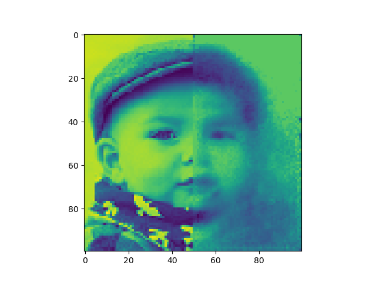

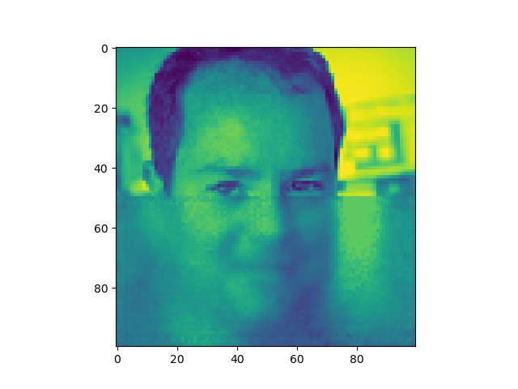

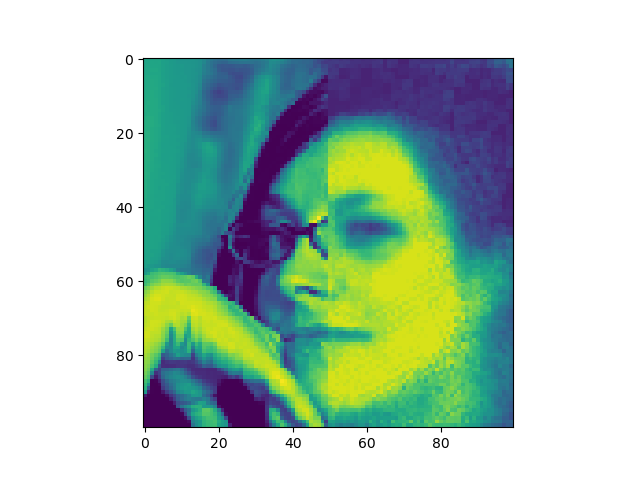

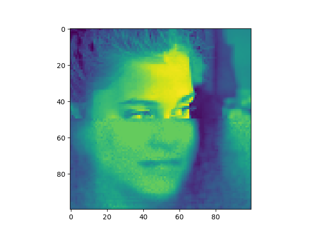
